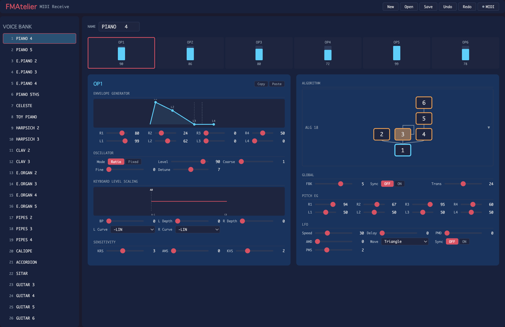

# FMAtelier



A browser-based voice editor for the YAMAHA DX7 synthesizer with Web MIDI support.

Edit DX7 voice parameters visually, load and save .syx bank files, and communicate with a real DX7 directly from the browser.

Built with Lit, Vite, and TypeScript. No additional runtime dependencies.

## Features

- Load and save standard .syx bank files (32-voice bulk dump)
- Edit all voice parameters: 6 operators, pitch EG, LFO, algorithm, feedback
- Algorithm diagram with all 32 DX7 algorithms
- Envelope and keyboard level scaling visualizations
- Voice and operator copy/paste
- Undo/Redo (up to 100 steps)
- Drag and drop .syx file import
- Web MIDI: send/receive voices with DX7 hardware
- Real-time parameter editing over MIDI
- Voice selection sync with DX7

## Getting Started

```bash
npm install
npm run dev
```

Open http://localhost:5173 in Chrome.

## Keyboard Shortcuts

| Shortcut | Action |
|----------|--------|
| Ctrl/Cmd + Z | Undo |
| Ctrl/Cmd + Shift + Z | Redo |
| Ctrl/Cmd + S | Save .syx file |
| Ctrl/Cmd + C | Copy voice |
| Ctrl/Cmd + V | Paste voice |

## MIDI Setup

### Requirements

- **Browser**: Chrome or Edge (required for SysEx support via Web MIDI API)
- **Hardware**: USB-MIDI interface

Click the **MIDI** button in the toolbar to open the MIDI panel. Select Input/Output ports and MIDI channel, then use Send/Rcv buttons.

### Connecting to a DX7

1. Connect a USB-MIDI interface between your computer and the DX7's MIDI IN/OUT
2. On the DX7, configure (all via FUNCTION + button 8):
   - **MIDI CH**: Set the channel (1-16)
   - **SYS INFO**: Set to **AVAIL** (enables automatic voice dump on voice change)
   - **MIDI TRANSMIT?**: Select YES to send all 32 voices as a bulk dump. Receiving this in FMAtelier first is recommended so you can start editing with the same bank data
3. In FMAtelier, select the USB-MIDI interface for Input and Output
4. Set the channel to match the DX7's setting
5. The MIDI indicator dot turns green when both ports are connected
6. To receive all 32 voices from the DX7, press FUNCTION + button 8 on the DX7, then select YES at **MIDI TRANSMIT?**. FMAtelier will automatically receive and display the bank data

## MIDI Features

### Send Voice

Sends the currently selected voice to the DX7's edit buffer. The voice is immediately audible on the DX7.

### Send Bank

Sends all 32 voices as a bulk dump (4104 bytes). See [Known Limitations](#known-limitations) for important notes about sending to real DX7 hardware.

### Real-Time Parameter Editing

When MIDI is connected, parameter changes made in FMAtelier are automatically sent to the DX7 as Parameter Change SysEx messages. Moving a slider or changing a value is immediately reflected on the DX7's edit buffer.

### Voice Selection Sync

When you change voices on the DX7 (with SYS INFO AVAIL = ON), FMAtelier automatically selects the matching voice in the bank by matching the voice name.

### Receive

- **Rcv Voice**: Requests a voice dump from the DX7's edit buffer
- **Rcv Bank**: Requests a full bank dump (32 voices)

**Note:** The original DX7 (1983) does not respond to dump requests. Later models such as the DX7II and TX7 support this feature, but this has not been verified with actual hardware.

The DX7 also sends voice data automatically when voices are changed on the front panel (SYS INFO AVAIL = ON).

## Known Limitations

### Bulk Dump to Real DX7

Sending a 32-voice bulk dump (4104 bytes) to a real DX7 may result in **data corruption from voice 6 onward**. This is caused by the DX7's UART receive buffer overflowing -- the original 1983 hardware cannot process the incoming data fast enough when sent at full MIDI speed.

The Web MIDI API does not provide byte-level flow control, so the data rate cannot be throttled from the browser.

**Workarounds:**

- Use **Send Voice** to transfer individual voices to the DX7's edit buffer, then store them manually
- Use a dedicated tool that can insert delays between bytes to transfer .syx files

**Note:** The .syx files generated by FMAtelier are 100% correct. This was verified by byte-for-byte comparison with original DX7 ROM cartridge dumps (0 differences). The issue is exclusively a hardware limitation of the DX7's serial receive buffer.

### Browser Support

| Browser | SysEx Support |
|---------|--------------|
| Chrome | Supported (verified on macOS) |
| Edge | Supported (Chromium-based, unverified) |
| Firefox | Requires installing a site permission add-on (unverified) |
| Safari | Not supported |

## Tech Stack

Lit 3 / Vite / TypeScript (strict) / Vitest
